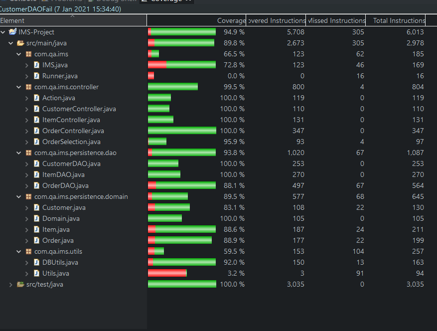

Coverage: 34%
# IMS Project

This application is an inventory management system. It can be used to create, read, update and delete customer, inventory item and order records in a persistent SQL database.

## Getting Started

These instructions will get you a copy of the project up and running on your local machine for development and testing purposes. See deployment for notes on how to deploy the project on a live system.

### Prerequisites

#### Java
[Java Development Kit (JDK)](https://www.oracle.com/java/technologies/javase-downloads.html) is required to build the application.

#### MySQL server
The application connects to a MySQL server. The fat jar is configured to connect to a server running on localhost. The application automatically creates a database called "ims" on the server if one doesn't already exist.

The MySQL server installer for Windows can be downloaded from [here](https://dev.mysql.com/downloads/installer/).

#### Maven
[Maven](https://maven.apache.org/download.cgi) is required to build the project and to run tests.

### Installation and usage

#### Installing

A step by step series of examples that tell you how to get a development env running

1. Download and install Java and Maven. Add environment variables to access them from the command line. On Windows this can be done by opening System Properties, clicking Environment Variables and adding the locations of the bin folders within the Java and Maven installation to the system path.
2. Download and run the MySQL server installer.
3. Clone the project Git repository onto your local machine, or download it as a .zip from GitHub and extract it.
4. Open a terminal and build the project by entering ```mvn clean package```. This will build the project and run the tests.
5. Run the application by navigating to the target folder and entering ```java -jar``` followed by the name of the .jar file in target that ends with ```jar-with-dependencies```.

#### Using the application

1. When the application opens you will be prompted for your username and password. By default these are both "root".
2. You will then be prompted to select a Domain: either customer, item, or order. Select Customer by typing customer and pressing enter - the selections are case-insensitive.
3. You will now be prompted to select an Action: either Read, Create, Update or Delete, or Return to Domain selection. Since the database is empty create a new customer by typing create, then enter a first name and last name when prompted. A customer ID is automatically generated for each customer, this can be viewed by using the Read Action.
4. Now similarly create some more customers and items, and once you have done so, create some orders.
5. You can now update and delete records in each of the Domains using the corresponding IDs. To delete customer or item records you must first delete any orders containing those customers or items.
6. To exit the application navigate to Domain and select Stop. The data is stored persistently by the database until the next time you use the application.

## Running the tests
You can run the unit tests for the application with ```mvn test```. If you want to run a specific test you can use the ```-Dtest``` flag e.g. to only run the test class OrderDAOTest, run ```mvn -Dtest=OrderDAOTest test```.

The test coverage for the ```src/main/java``` folder is 89.8%. The coverage report is below.



## Deployment

To use this application on a live system you will probably want to specify the server to be used e.g. you may want to interact with a cloud SQL server. In order to change the database URL, edit the DB_URL variable in ```src/main/java/com/qa/ims/utils/DBUtils.java``` and rebuild the project.

## Built With

* [Maven](https://maven.apache.org/) - Dependency Management

## Versioning

We use [SemVer](http://semver.org/) for versioning.

## Authors

* **Chris Perrins** - *Initial work* - [christophperrins](https://github.com/christophperrins)
* **Kieran Hanahoe** - [khanahoe-qa](https://github.com/khanahoe-qa)

## License

This project is licensed under the MIT license - see the [LICENSE.md](LICENSE.md) file for details 

## Acknowledgments

* Thanks to the QA trainers for teaching me and helping me with the project, particularly Piers Barber, Vinesh Ghela and Edward Reynolds.
